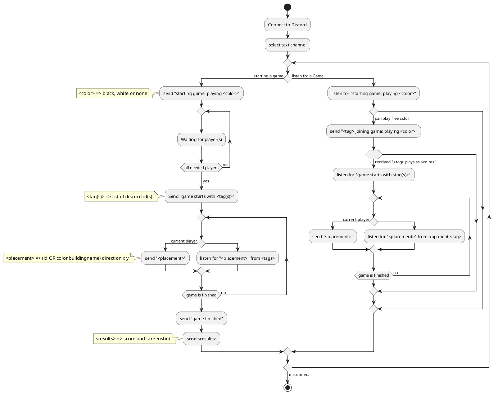

```plantuml:discord
@startuml

start

:Connect to Discord;
:select text channel;
repeat
 if () then (starting a game)

  :send "starting game: playing <color>";
  note left: <color> => black, white or none

  repeat
   :Waiting for player(s);
  repeat while (all needed players) is (no)
  ->yes;

  :Send "game starts with <tag(s)>";
  note left: <tag(s)> => list of discord-id(s)

  repeat

   if() then (current player)
    :send "<placement>";
   note left: <placement> => (id OR color buildingname) direction x y
   else
    :listen for "<placement>" from <tags>;
   endif

  repeat while (game is finished) is (no)

  :send "game finished";
  :send <results>;
  note left: <results> => score and screenshot

 else (listen for a Game)

  :listen for "starting game: playing <color>";
  
  if() then (can play free color)

   :send "<tag> joining game: playing <color>";
   if ( ) then ( )
   else (received "<tag> plays as <color>")

   :listen for "game starts with <tag(s)>";

   repeat

    if() then (current player)
     :send "<placement>";
    else
     :listen for "<placement>" from opponent <tag>;
    endif

  repeat while (game is finished) is (no)


endif

  endif

 endif

repeat while ( ) is ( ) not (disconnect)


stop

@enduml
```

