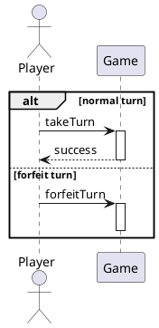
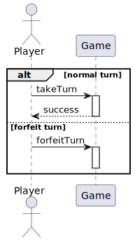

```plantuml:take-a-turn
@startuml
Actor       Player    as P
Participant Game      as G

alt normal turn

 P -> G : takeTurn
 activate G
 return success

else forfeit turn

 P -> G : forfeitTurn
 activate G
 deactivate G

end
@enduml
```

