# Discord
This framework can use discord[https://discord.com/](https://discord.com/) to play games. To use this feature you need to set up a discord bot and connect to it.

## Setting up the bot
1. Log into the developer portal: [https://discord.com/developers/applications](https://discord.com/developers/applications)
2. Create a new Application  
   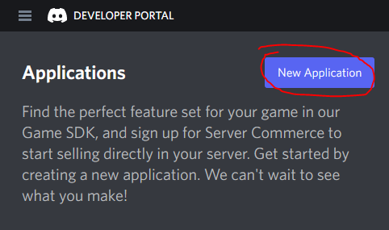
3. Select a Name. This will be the name of your bot!  
   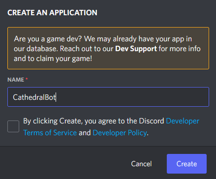
4. Transform your application to a bot  
   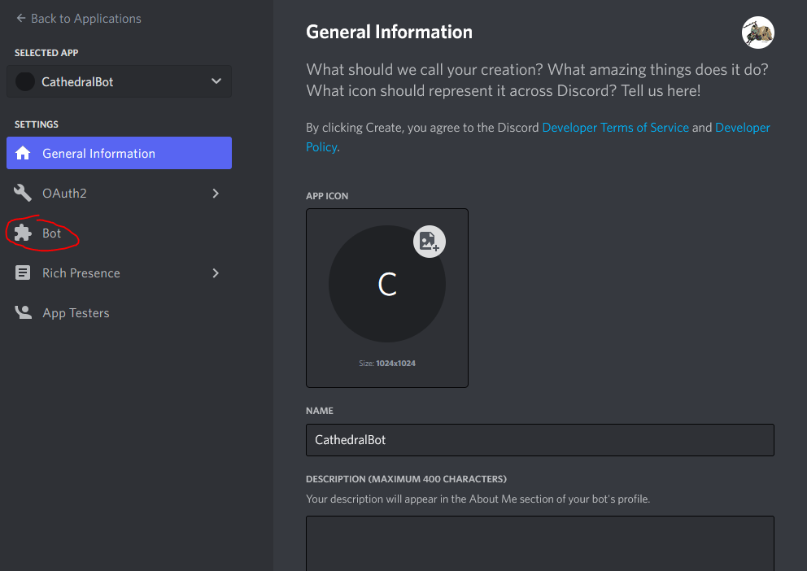  
   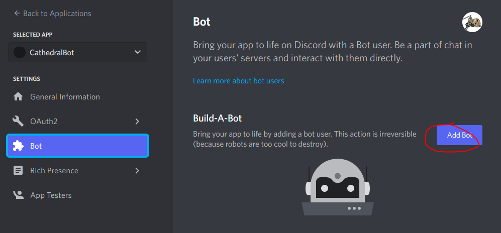
5. Reset and remember your token. This is needed to connect to discord!  
   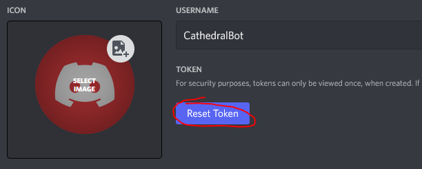  
   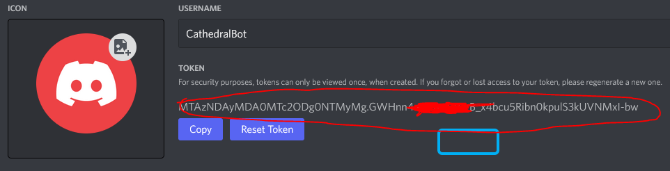
6. Set your bot to receive message content  
   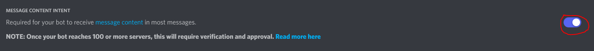
7. Save your changes
8. Go to OAuth -> URL Generator. Enable the 'Bot' scope and 'Send Messages' and 'Manage Messages' permissions.  
   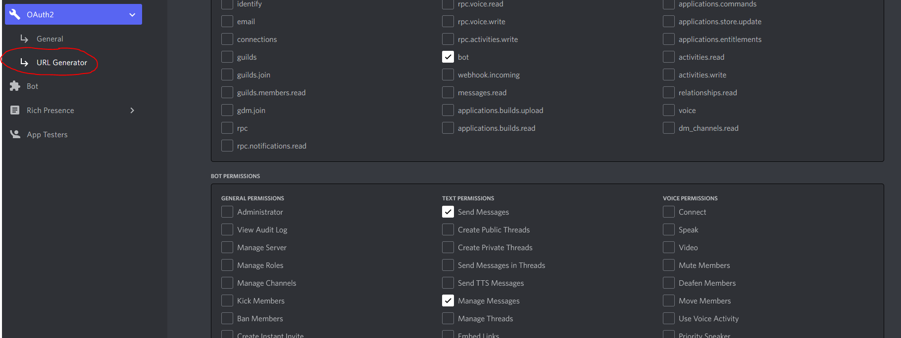  
9. Copy and use or give Others the created Link to be able to add your bot to servers.  
   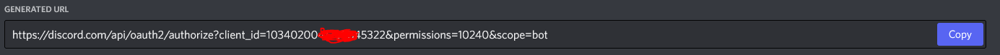
10. Use the link to add the bot to your servers or get others to add it to theirs.  
    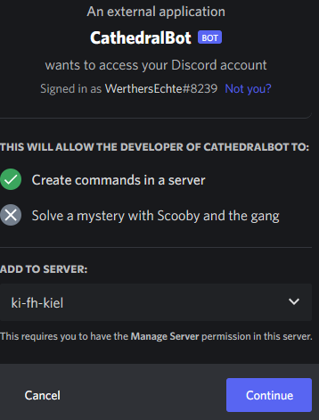
    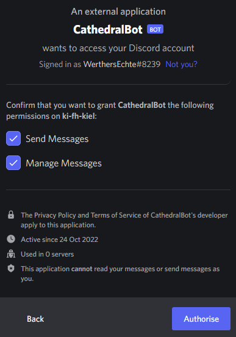
11. Use your new bot

## Connecting to the bot
### Using the GUI  
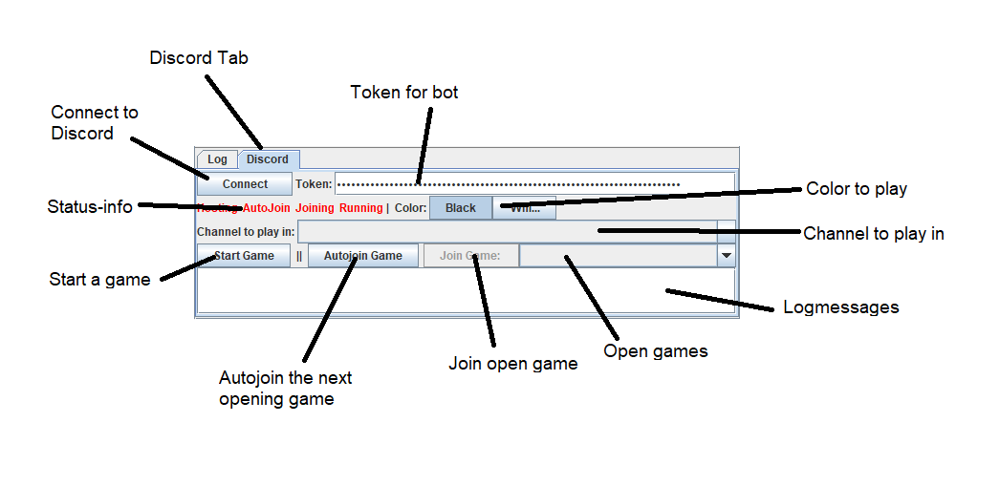  
**Connect to Discord** uses the given **Token** to connect to the corresponding bot.  
The **Status-Info** shows if you currently host a game, **Autojoin** is enabled, are in the process of joining a game and currently playing a game.  
**Start Game** starts a game with you as a host and will wait for others to join.  
**Autojoin** joins any new game game as long as you are not currently playing a game.
**Open games** are show all known joinable games.

### Start the application with a token and default channel
To set the token and the channel to listen in

```java
import de.fhkiel.ki.cathedral.gui.CathedralGUI;

public class Test {
  public static void main(String[] args) {
     CathedralGUI.start(
             Settings.Builder()
                     .token("TOKEN")
                     .default_channel("SERVER::CHANNEL")
                     .build(),
             AGENT-OBJECTS);
  }
}
```

