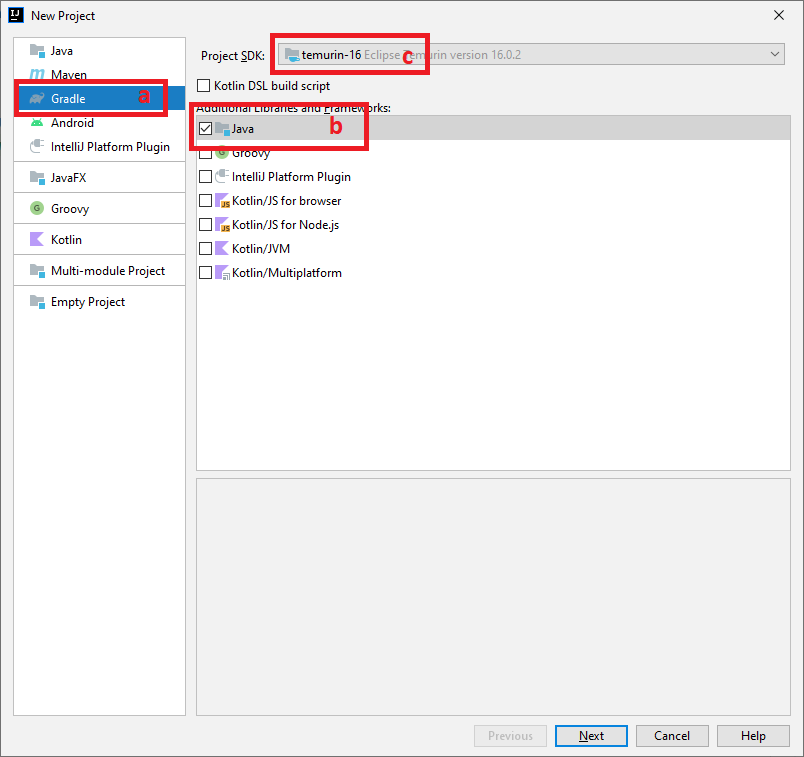
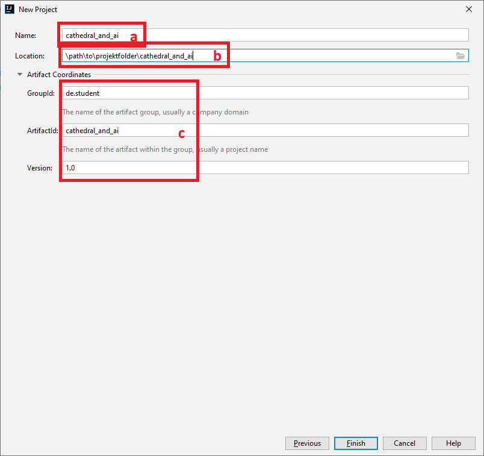
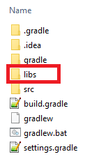
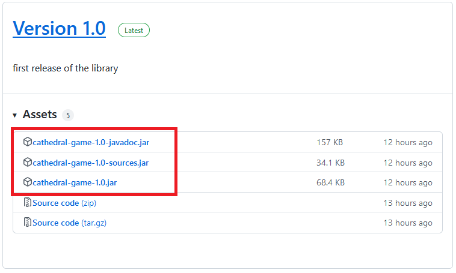
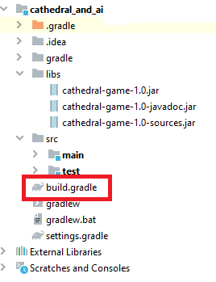

# Project setup
This tutorial is written for Intellij IDEA [https://www.jetbrains.com/idea/](https://www.jetbrains.com/idea/).  
If there exist newer binaries than the ones used in this tutorial, use them instead.

## Setup

1. Start Intellij IDEA
2. Create a new Gradle Java project with at least Java version 16  
     
   a. Select Gradle  
   b. Select Java  
   c. Select a project Java SDK 16+


3. Select a name and folder  
     
   a. Select a name for your project  
   b. Select where to create your project in your filesystem  
   c. Change the GroupId, ArtifactId and Version of your project to something you want


5. Finish the creation
6. Wait for Gradle to build the project
7. Create a new folder named `libs` in your projectfolder  
     

__<span style="color:red">If there are newer binaries than the ones shown here, use them</span>__
8. Download the binaries from [https://github.com/WerthersEchte/cathedral/releases/latest](https://github.com/WerthersEchte/cathedral/releases/latest)  
     
   and save them in the libs folder. They should be visible in the intellij IDEA project view.  
     

__<span style="color:red">If there are newer binaries than the ones shown here, use them</span>__
10. Now open the `build.gradle` file  
     
11. Add to the `repositories` section following code
```gradle
flatDir {
   dirs 'libs'
}
```
   This allows Gradle to use the `libs` folder as an impromptu binary-repository
12. Add to the `dependencies` section following code
```gradle
implementation name: 'cathedral-game-1.0'
implementation "com.discord4j:discord4j-core:3.2.3"
```

__<span style="color:red">If you use newer binaries change `cathedral-game-1.0` to the ones you use</span>__  
   Gradle will load the binaries, allow you to use them with the source and javadoc-support  

13. `build.gradle` should look somewhere like this:  

```gradle  
plugins {
    id 'java'
}

group 'de.student'
version '1.0'

repositories {
    mavenCentral()
    flatDir {
        dirs 'libs'
    }
}

dependencies {
    implementation name: 'cathedral-game-1.0'
    implementation "com.discord4j:discord4j-core:3.2.3"
    
    testImplementation 'org.junit.jupiter:junit-jupiter-api:5.8.1'
    testRuntimeOnly 'org.junit.jupiter:junit-jupiter-engine:5.8.1'
}

test {
    useJUnitPlatform()
}
```

14. Rebuild your project with gradle  
    

16. Test your project  
   Create a Class with a main function like this:  
   
```java
import de.fhkiel.ki.cathedral.gui.CathedralGUI;

public class Test {
  public static void main(String[] args) {
    CathedralGUI.start();
  }
}
```

17. Run the main function. You should see the cathedral GUI


Next:  
[Using the game implementation](./game.html)  
[Using the GUI](./gui.html)  
